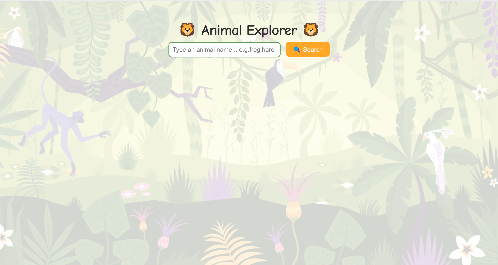
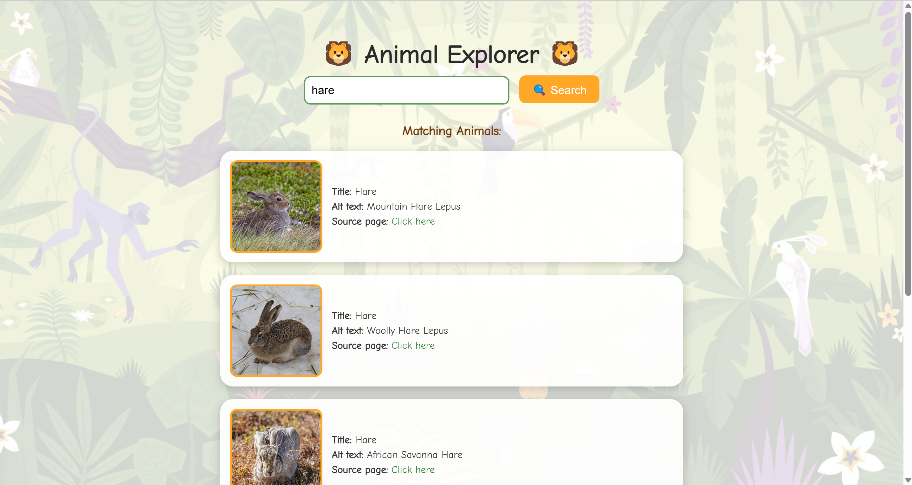
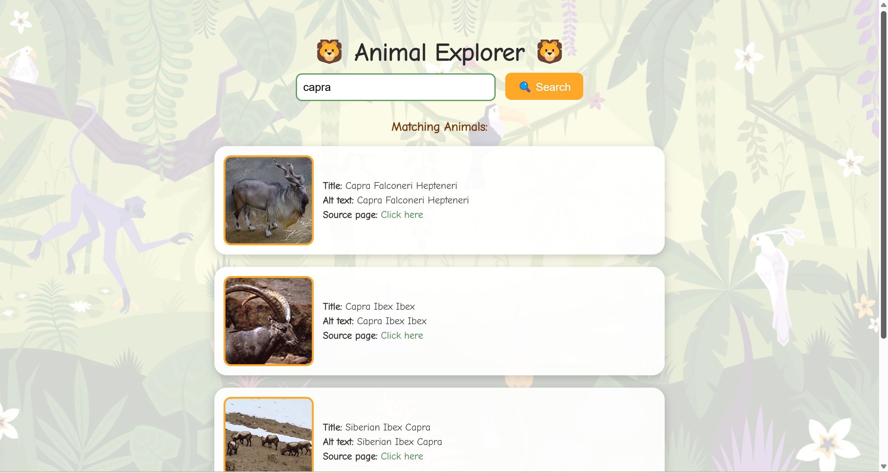
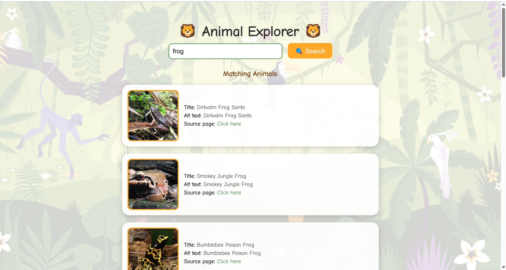

# Wikipedia-Based Image Search Engine

##  Overview
This project implements a lightweight image search engine focused on animal-related images from Wikipedia. It combines BM25-based keyword search with CLIP-based visual similarity for re-ranking. The goal is to replicate the simplicity of early Google Image Search while enhancing accuracy using modern vision-language models.

---

## Features
-  Custom web crawler for Wikipedia animal categories  
-  Image annotation using title, alt text, file name, and animal name  
-  BM25 keyword-based retrieval  
-  CLIP re-ranking for visual similarity  
-  Jungle-themed, responsive web interface using Flask  

---

## How to Run
1️. **Clone the Repository**
   git clone https://github.com/ChandralekhaV/search-engine-project/tree/main/Search%20Engine%20Assignment%202
   
   cd search-engine-project/assignment2

2️. **Install Dependencies**
    ```bash
    pip install -r requirements.txt
    
    
    To use CLIP:
      
      pip install git+https://github.com/openai/CLIP.git

3. **Crawl and collect images**  
   ```bash
   python crawler.py
This gathers images and metadata into image_surrogates.json

4. **Index images for BM25 search**
    ```bash
    python indexer.py
Generates BM25 indexes for text-based search

5. **Generate CLIP embeddings**
    ```bash
    python embed_images.py
Creates image_embeddings.json for re-ranking

6. **Launch the web interface**
     ```bash
     python app.py
Then visit http://127.0.0.1:5000 in your browser


Try These Queries - 
        hare, capra, frog, deer, civet, kudu, rabbit, wolf, savanna, mongoose, sheep, leopard 

### Homepage  


### Search Example  



